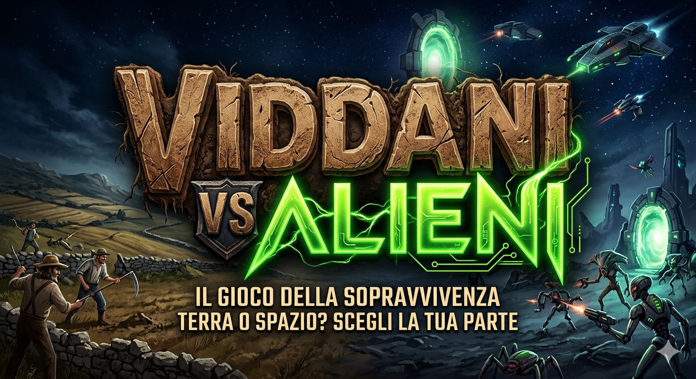

# 👽 Viddani VS Alieni



Progetto di **Ingegneria del Software** per la realizzazione di un videogioco chiamato **Viddani VS Alieni**: un **gioco di ruolo (RPG) a livelli**.

---

## 📖 Descrizione

Gli alieni, provenienti dal pianeta **Proxima Centauri b** (un mondo ostile e scarsamente abitabile), stanno tentando di invadere la Terra per trovare una nuova casa. Per questo motivo si scontrano con i *Viddani*, i fieri contadini pronti a difendere il loro territorio. L'obiettivo principale del gioco è sconfiggere gli invasori spaziali e impedire loro di conquistare il pianeta.

In *Viddani VS Alieni* il giocatore affronta l'invasione attraversando livelli progressivi, con difficoltà crescente, nemici sempre più forti e obiettivi specifici da completare.

Il progetto unisce:
- 📊 Analisi dei requisiti
- 🏗️ Progettazione software
- 💻 Implementazione del gioco
- ✅ Verifica e validazione

---

## 🎯 Obiettivi del progetto

- Progettare un'architettura chiara, modulare e manutenibile.
- Sviluppare meccaniche RPG a livelli (progressione, sfide, ricompense).
- Applicare buone pratiche di sviluppo collaborativo (Git, issue tracking, review).
- Documentare in modo completo le scelte progettuali e implementative.

---

## ✨ Caratteristiche previste del gioco

- **Progressione a livelli**: ci saranno in totale **3 livelli**, con un aumento graduale della difficoltà e ambientazioni uniche:
  - **Livello 1:** La Campagna (nei campi terrestri).
  - **Livello 2:** La Navicella Aliena.
  - **Livello 3:** Il Pianeta degli Alieni (Proxima Centauri b).
- **Sistema di combattimento** contro diverse tipologie di alieni, culminante con un **boss finale per ogni livello**.
- **4 personaggi giocabili** con abilità e stili di gioco differenti.
- **Obiettivi di livello** (es. sopravvivenza, eliminazione boss, raccolta risorse).
- **Interfaccia chiara** per menu, stato del personaggio e avanzamento.
- **Interazioni con NPC** basate su esperienza, altruismo e scelte morali.
- **Modalità cooperativa locale a turni** per massimo 2 giocatori.

---

## 🧑‍🌾 Personaggi giocabili

Ogni personaggio ha estetica, arma e abilità base dedicate. Inoltre, progredendo nel gioco e salendo di livello, i personaggi potranno sviluppare e sbloccare nuove **abilità speciali**. Le scelte del giocatore influenzano il modo in cui i personaggi interagiscono tra loro e con gli NPC.

- 👴 **Il Nonno**  
  **Aspetto:** coppola, sedia a rotelle.  
  **Arma:** doppietta ("scupetta").  
  **Abilità Base:** elevata **potenza con il fucile**.  
  **Abilità Speciale (sbloccabile):** *Salto con la sedia a rotelle* (un salto molto potente che genera un'onda d'urto). PIRATA DELLA STRADA

- 👦 **Il Giovane (Bambino)**  
  **Aspetto:** canotta bianca.  
  **Arma:** fionda.  
  **Abilità Base:** alta **velocità**.  
  **Abilità Speciale (sbloccabile):** *Pioggia di pietre* (lancia un sacchetto di pietre da tutte le parti).

- 👨 **Il Papà**  
  **Aspetto:** camicia a quadri, look rustico.  
  **Arma:** zappa.  
  **Abilità Base:** attacchi ravvicinati potenti con la **zappa**.  
  **Abilità Speciale (sbloccabile):** *Il lancio del viddano* (lancia la zappa tipo boomerang).

- 👩 **La Mamma**  
  **Aspetto:** look da contadina, con cappello di paglia e bretelle.  
  **Arma:** ciabatta.  
  **Abilità Base:** supporto, può **curare gli altri personaggi con il Voltaren**.  
  **Abilità Speciale (sbloccabile):** *Cura di gruppo* (cura tutti i giocatori contemporaneamente).

---

## 👾 I Nemici (Alieni)

Gli antagonisti principali del gioco sono gli Alieni, suddivisi in **3 classi differenti**.
**Regola d'ingaggio:** Quando il giocatore incontra un alieno sul suo cammino, **la battaglia inizia immediatamente**.
Inoltre, la regola alla base della forza dei nemici è: **più sono numerosi, meno sono potenti**. Questo costringerà i giocatori ad adattare le loro strategie in base alla quantità e al tipo di alieni presenti.
Al termine di ciascuno dei 3 livelli, è prevista una sfida decisiva contro un **boss finale**.

---

## 🎮 Modalità di gioco

- Massimo **2 giocatori**.
- Turni alternati tra i giocatori.
- Possibilità di scegliere personaggi e strategie diverse a ogni livello.

---

## 🗣️ NPC, altruismo e ricompense

Durante i livelli il giocatore incontra NPC con cui può interagire. I dialoghi con gli NPC sono guidati da un'**Intelligenza Artificiale** (utilizzando un modello open source eseguito in locale), per offrire conversazioni dinamiche, imprevedibili e caratterizzate da **divertenti scambi di battute in dialetto siciliano**.
**Regola d'ingaggio:** A differenza degli alieni, quando si incontra un NPC **prima si dialoga**; solo al termine della conversazione, e unicamente se le scelte del giocatore o la trama lo richiedono, partirà un'eventuale battaglia.

- Gli NPC possono regalare oggetti.
- Alcuni NPC possono proporre missioni secondarie o richiedere oggetti specifici.
- Il giocatore può anche scegliere di **rubare** gli oggetti, con possibili conseguenze sulla barra del carattere.

### ❤️ Barra Carattere: Altruismo vs Egoismo

Il gioco include una barra `Carattere` con due poli opposti:
- **Altruismo** da un lato.
- **Egoismo** dall'altro lato.

**Regola principale:**
- Se la barra `Carattere` scende **sotto i 100 punti**, diventa **rossa**.
- Lo stato rosso indica che i personaggi stanno diventando **egoisti**.
- Le scelte dei giocatori (aiutare, cooperare, rubare, ecc.) influenzano direttamente il valore della barra.

---

## 🎒 Oggetti trovabili

Il sistema oggetti includerà consumabili, potenziamenti, equipaggiamenti e ricompense rare legate all'esplorazione e alle interazioni con NPC.
La lista completa degli oggetti verrà definita nelle prossime milestone di progettazione.

---

## 🛠️ Stack tecnologico (work in progress)

- **Linguaggio:** Java ☕
- **Framework di gioco:** libGDX 🎮
- **Build tool:** Gradle 🐘

---

## 📁 Struttura del repository

- `core/` - Logica di gioco condivisa.
- `lwjgl3/` - Launcher desktop e configurazione runtime.
- `assets/` - Risorse grafiche, audio e file di gioco.

---

## 🚀 Come avviare il progetto

### Prerequisiti
- **Java Development Kit (JDK)** installato (versione 17 o superiore consigliata).
- **Git** installato nel sistema.

### Esecuzione da Terminale (Desktop)
1. **Clona il repository**:
   ```bash
   git clone https://github.com/pcodez99/progetto-ISS-2025-2026.git
   ```
2. **Spostati nella directory del progetto**:
   ```bash
   cd progetto-ISS-2025-2026
   ```
3. **Avvia il gioco tramite Gradle Wrapper**:
   - Su Linux/macOS:
     ```bash
     ./gradlew lwjgl3:run
     ```
   - Su Windows:
     ```cmd
     gradlew.bat lwjgl3:run
     ```

### Esecuzione tramite IDE (es. IntelliJ IDEA)
1. Apri IntelliJ IDEA.
2. Seleziona **File > Open** e scegli la cartella del progetto.
3. Attendi il caricamento e la sincronizzazione di Gradle.
4. Esegui il launcher desktop avviando la classe `Lwjgl3Launcher` presente nel modulo `lwjgl3`.

---

## 🤝 Come contribuire al progetto

Siamo felici di accettare contributi! Per contribuire al progetto, segui questi passaggi:

1. **Esegui un fork** del repository.
2. **Crea un branch** per la tua feature o bugfix (`git checkout -b feature/nuova-feature`).
3. **Effettua i tuoi commit** descrivendo chiaramente i cambiamenti (`git commit -m 'Aggiunta nuova funzionalità'`).
4. **Fai il push** del branch sul tuo fork (`git push origin feature/nuova-feature`).
5. **Apri una Pull Request** descrivendo nel dettaglio le modifiche apportate.

Assicurati che il codice rispetti le linee guida del progetto e passi tutti i test locali prima di aprire una Pull Request.

---

## 📈 Stato del progetto

Il progetto è in sviluppo. Le funzionalità verranno introdotte in modo incrementale per milestone.

---

## 🗺️ Roadmap iniziale

- [ ] Definizione requisiti funzionali e non funzionali
- [ ] Progettazione architettura e diagrammi principali
- [ ] Implementazione prototipo giocabile
- [ ] Introduzione sistema livelli e progressione RPG
- [ ] Testing, bilanciamento e rifinitura

---

## 🎓 Team e contesto

Questo repository è sviluppato nell'ambito di un corso/progetto universitario di **Ingegneria del Software**.
